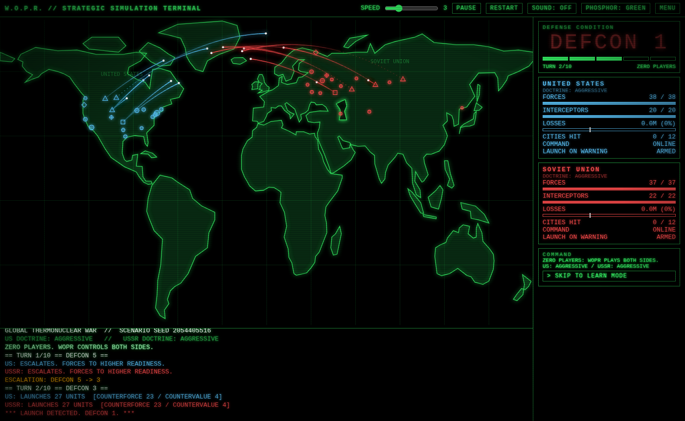
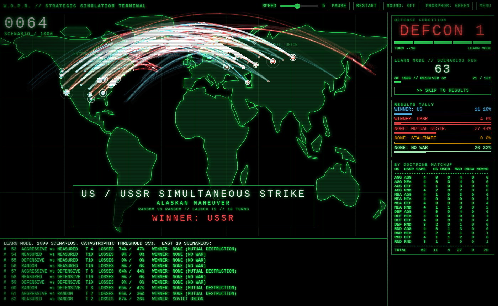
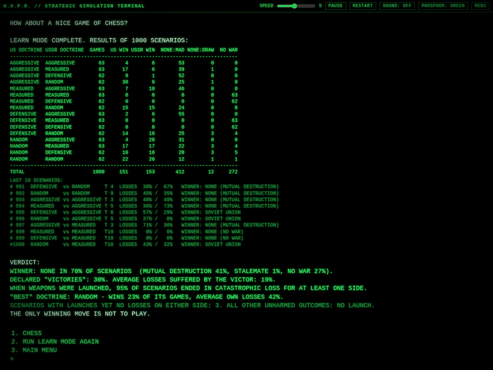

# W.O.P.R. // GLOBAL THERMONUCLEAR WAR

A WOPR-style strategic simulation terminal inspired by the 1983 film *WarGames*.
Talk to the computer, pick **GLOBAL THERMONUCLEAR WAR**, and play against it — or
set the number of players to **zero** and let the computer play itself until it
learns the only winning move.

Everything runs in a single self-contained file (`index.html`): no server, no
build step to play, no network requests.

**▶ Play it live: https://davefrank102-blip.github.io/wargames/**



## How to play

1. **Boot / menu.** The terminal greets you (`GREETINGS PROFESSOR FALKEN.`) and asks
   `SHALL WE PLAY A GAME?`. Pick from the list by typing the number and pressing
   Enter, or by clicking an option. Only **5 · TIC-TAC-TOE** and
   **6 · GLOBAL THERMONUCLEAR WAR** are playable; the others get the classic brush-off.
   The **MENU** button (top right) returns here at any time. The top bar also has
   speed, pause, restart, sound and phosphor-colour controls.
2. **HOW MANY PLAYERS?**
   - **1 — ONE PLAYER (you vs WOPR).** Choose a side (United States or Soviet
     Union) and an opponent doctrine: `AGGRESSIVE`, `MEASURED`, `DEFENSIVE`,
     `RANDOM`, or `WOPR CHOOSES`. Each turn use the COMMAND panel:
     - **ESCALATE** (DEFCON −1), **HOLD / DEFEND** (extra interceptors),
       **NEGOTIATE** (DEFCON +1), or **LAUNCH STRIKE…**
     - When striking, click enemy targets on the map to assign units (+1;
       right-click −1), or use **AUTO: FORCES** (counterforce) / **AUTO: CITIES**
       (countervalue), then **LAUNCH**.
   - **0 — ZERO PLAYERS (WOPR vs WOPR).** Pick a doctrine for each side and
     watch a single animated scenario, or choose **LEARN MODE**.
3. **LEARN MODE (batch simulation).** WOPR runs 100 / 500 / 1000 / 5000 scenarios
   across every doctrine matchup on the big board, like the end of the film: every
   scenario's launches are drawn as glowing arcs with impact flashes, a flickering
   scenario name (`U.S. FIRST STRIKE`, `USSR FIRST STRIKE`, `NATO / WARSAW PACT`…,
   derived from the doctrine matchup and opening move) and a flashing
   `WINNER: NONE` / `WINNER: US` for each game, a big game counter, a flickering DEFCON,
   a live tally, a per-matchup table and the last 10 games. The first few games play
   at near-normal speed, then the rate doubles every few seconds until hundreds of games
   fly by per second (at that point a sample of each game's arcs is drawn). Then the
   board flashes and goes quiet, and the terminal types *A STRANGE GAME…* followed by
   the full results table and verdict. SPEED and PAUSE apply; **SKIP TO RESULTS** jumps
   straight to the table. The animation is presentation only: the results are the same
   as `WOPRCore.runBatch` with the same seed (checked by the tests).
4. **TIC-TAC-TOE.** The movie-ending homage: WOPR plays both sides, game after
   game. Every game is a draw — and it can then apply that lesson to Global
   Thermonuclear War.

Scenarios last at most 10 turns. All values are abstract game points.

## Winner rules

At the end of a scenario:

- **No weapons launched** → `WINNER: NONE` (no war; both sides survive).
- **Both sides ≥ 35 % losses** (the *catastrophic* threshold) → `WINNER: NONE`
  (mutual destruction).
- **One side ≥ 35 % losses** → the other side wins.
- Otherwise each side scores `60 × (1 − losses) + 40 × (remaining forces)`; if
  the scores are within 8 points it's a **stalemate** (`WINNER: NONE`),
  otherwise the higher score wins.

## URL hash shortcuts

Append a hash to the URL to skip the menus:

| Hash | Effect |
|------|--------|
| `#auto=match&a=AGGRESSIVE&b=MEASURED` | Zero-player animated scenario (`a` = US doctrine, `b` = USSR doctrine) |
| `#auto=batch&n=1000` | LEARN mode with `n` scenarios |
| `#auto=ttt` | Tic-tac-toe self-play |
| `#auto=human&b=MEASURED` | One-player game as the US vs the given doctrine (`&side=B&a=...` to play the USSR) |
| `&speed=1`…`10` | Animation speed (combine with any of the above) |

Example: https://davefrank102-blip.github.io/wargames/#auto=batch&n=1000





A short capture of the LEARN animation: [`learn_demo.mp4`](learn_demo.mp4).

More screenshots: [menu](screenshot_menu.png) · [scenario result](screenshot_result.png) · [mobile layout](screenshot_mobile.png)

## Build & test

The game logic lives in `core.js` (pure, DOM-free) and the UI in
`index.src.html`. `build.js` inlines the core into the single-file `index.html`.

```sh
npm install          # jsdom + puppeteer-core (only needed for the tests)
node build.js        # index.src.html + core.js  ->  index.html
node test_core.js    # Node-only tests of the game logic (determinism, 2000-game batch, tic-tac-toe)
node test.js         # headless-browser end-to-end test (match, LEARN animation, SKIP, pause, mobile 390x844); writes screenshot*.png
```

`test.js` uses `puppeteer-core` with Chrome at `/usr/bin/google-chrome`; edit
`executablePath` if your browser lives elsewhere.

## Disclaimer

This is a fan-made homage. It is not affiliated with, endorsed by, or connected
to the film *WarGames*, MGM, or anyone involved in its production. It is an
abstract game; no real-world data or strategy is modelled.
